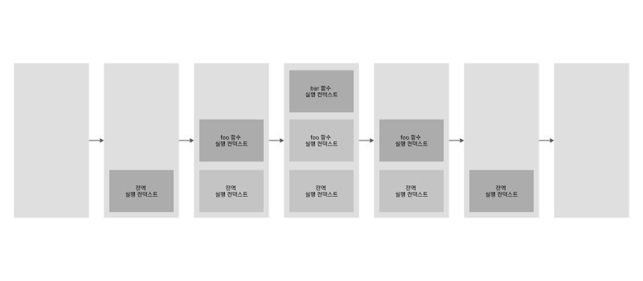

# 실행 컨텍스트

## 1. 실행 컨텍스트

ECMAScirpt 스펙에 따르면 실행 가능한 코드를 형상화하고 구분하는 추상적인 개념이라고 정의한다. 즉 코드가 실행되기 위한 환경이라고 할 수 있다. 실행이 되기 위한 코드는 아래와 같다.

- 전역 코드 : 전역 영역에 존재하는 코드
- Eval 코드 : eval 함수로 실행되는 코드
- 함수 코드 : 함수 내에 존재하는 코드

자바스크립트 엔진은 코드를 실행하기 위해 여러가지 정보가 필요하다. 여러가지 정보란 아래와 같다.

- 변수 : 전역변수, 지역변수, 매개변수, 객체의 프로퍼티
- 함수 선언
- 변수의 유효범위(Scope)
- this

**예제**
```js
const x = 'xxx';

function foo() {
  const y = 'yyy';

  function bar() {
    const z = 'zzz';
    console.log(x + y + z);
  }
  bar();
}
foo();
```


1. 컨트롤이 실행 가능한 코드로 이동하면 새로운 실행 컨텍스트 스택이 생성된다.
2. 전역 코드로 컨트롤이 진입하면 전역 실행 컨텍스트가 생성되고 실행 컨텍스트 스택에 쌓인다.
3. 함수를 호출하면 해당 함수의 실행 컨텍스트가 생성되며 직전에 실행된 코드 블록의 실행 컨텍스트 위에 쌓인다.
4. 함수 실행이 끝나면 해당 함수의 실행 컨텍스트를 파기하고 진적의 실행 컨텍스트에 컨트롤을 반환한다.

## 2. 실행 컨텍스트의 3가지 객체

- 실행 컨텍스트는 객체의 형태를 가지고 있고 3가지의 프로퍼티를 소유한다.

### 2-1 Variable Object (VO/변수객체)
Variable Object(VO/변수객체)는 코드가 실행될 때 엔진에 의해 참조되며 코드에서는 접근할 수 없다. Varialbe Object는 아래의 정보를 담는 객체이다.

- 변수
- 매개변수(parameter)와 인수 정보(arguments)
- 함수 선언(함수 표현식은 제외)

**전역 컨텍스트**
Variable Object는 유일하며 최상위에 위치한다. 모든 전역 변수, 전역 함수 등을 포함하는 전역 객체(Global Object)를 가리킨다.
