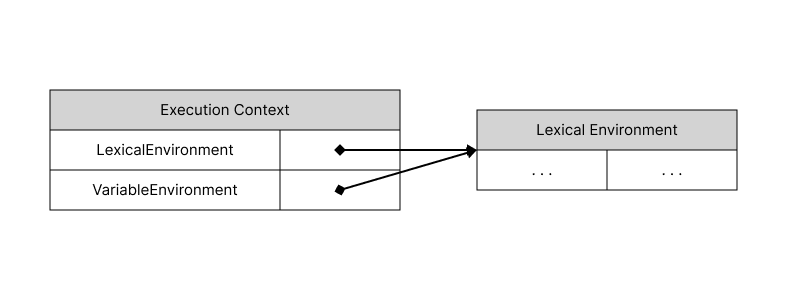

# 실행 컨텍스트

## 1. 실행 컨텍스트란
- 자바스크립트의 scope, hoisting, this, function, closure 등 동작원리를 담고 있는 핵심 개념이다.
- ECMAScript 스펙에 따르면 실행 컨텍스트를 실행 가능한 코드를 형상화 하고 구분하는 추상적인 개념라고 정의하고 있다.

## 2. 소스코드

### 소스코드의 타입
- ECMAScript 사양은 소스코드(ECMAScript code)를 4가지 타입으로 구분한다. 4가지 타입의 소스코드는 실행 컨텍스트를 생성한다.

| 소스코드의 타입 | 설명 |
| --- | --- |
| 전역코드 | 전역에 존재하는 소스코드를 말한다. 전역에 정의된 함수, 클래스 등의 내부 코드는 포함되지 않는다. |
| 함수 코드 | 함수 내부에 존재하는 소스코드를 말한다. 함수 내부에 중첩된 함수, 클래스 등의 내부 코드는 포함되지 않는다. |
| eval 코드 | 빌트인 전역 함수인 eval 함수에 인수로 전달되어 실행되는 코드를 말한다. |
| 모듈 코드 | 모듈 내부에 존재하는 소스코드를 말한다. 모듈 내부의 함수, 클래스 등의 내부 코드는 포함되지 않는다. |

> eval 함수: 문자로 표현된 JavaScript 코드를 실행하는 함수

1. 전역 코드
- 전역 코드는 전역 변수를 관리하기 위해 전역 스코프를 생성.
- var 키워드로 선언된 전역 변수와 함수 선언문으로 정의된 전역함수를 전역 객체의 프로퍼티와 메서드로 바인딩하고 전역 객체와 연결.
- 이를 위해 전역 코드가 평가되면 전역 실행 컨텍스트가 생성.
  
2. 함수 코드
- 함수 코드는 지역 스코프를 생성하고 지역 변수, 매개변수, arguments 객체를 관리한다.
- 생성한 지역 스코프를 전역 스코프에서 시작하는 스코프 체인의 일원으로 연결해야 한다.
- 이를 위해 함수 코드가 평가되면 함수 실행 컨텍스트가 생성.

3. eval 코드
- eval 코드는 strict mode(엄격 모드)에서 자신만의 독자적인 스코프를 생성한다.
- 이를 위해 eval 코드가 평가되면 eval 실행 컨텍스트가 생성

4. 모듈 코드
- 모듈 코드는 모듈별로 독립적인 모듈 스코프를 생성한다. 
- 이를 위해 모듈 코드가 평가되면 모듈 실행 컨텍스트가 생성

### 소스코드의 평가와 실행
- 자바스크립트 엔진은 소스코드를 "소스코드의 평가"와 "소스코드의 실행" 과정으로 나누어 처리한다.
- 평가 과정에서는 실행 컨텍스트를 생성하고 변수, 함수 등의 선언문만 먼저 실행한 후, 변수나 함수 식별자를 키로 하여 실행 컨텍스트가 관리하는 스코프에 등록
- 위의 평가 과정이 끝나면 비로소 선언문을 제외한 소스코드가 순차적으로 실행된다. 소스코드 실행에 필요한 정보는 실행 컨텍스트가 관리하는 스코프에서 검색하여 취득한다.

```js
// 예제
var x;
x = 1;
```
**평가 과정**
| 실행 컨텍스트 ||
| :---: | ---: |
| x | undefined|
- 평가 과정에서는 변수 선언문 var x;를 먼저 실행한다. 
- 이때 생성된 변수 식별자 x는 실행 컨텍스트가 관리하는 스코프에 등록되고 undefined로 초기화된다.

**실행 과정**
| 실행 컨텍스트 ||
| :---: | --- |
| x | 1 |
- 실행 컨텍스트가 관리하는 스코프에 x 변수가 등록되어 있는지 확인한다.(선언 확인)
- 실행 컨텍스트가 관리하는 스코프에 x 변수가 등록되어 있다면 값을 할당한다.

## 3. 실행 컨텍스트의 역할
```js
// 전역 변수 선언
const x = 1;
const y = 2;

// 함수 선언
function foo(a) {
  // 지역 변수 선언
  const x = 10;
  const y = 10;

  // 메서드 호출
  console.log(a + x + y);
}

// 함수 호출
foo(100);

// 메서드 호출
console.log(x + y);
```

1. 전역 코드 평가 
- 선언문만 먼저 실행된다.
- 생성된 전역 변수와 전역 함수가 실행 컨텍스트가 관리하는 전역 스코프에 등록된다.

2. 전역 코드 실행
- 전역 코드 평가 과정이 끝나고 런타임이 시작되면 전역 코드가 순차적으로 실행된다.
- 전역 변수에 값이 할당되고 함수가 호출된다.
- 함수 호출문을 만나면 순차적으로 실행되던 전역 코드의 실행을 중단하고 함수 내부로 진입한다.

3. 함수 코드 평가
- 매개변수와 지역 변수 선언문이 먼저 실행된다.
- 생성된 매개변수와 지역 변수, 그리고 arguments 객체가 실행 컨텍스트가 관리하는 지역 스코프에 등록되고 this 바인딩도 결정된다.

4. 함수 코드 실행
- 평가 과정이 끝나고 함수 코드가 순차적으로 실행된다.
- 매개변수와 지역 변수에 값이 할당되고 console.log 메소드가 호출된다.
- 식별자 console을 스코프 체인을 통해 검색한다. 검색은 함수의 지역 스코프 > 상위 스코프(위 예제에서는 전역 스코프) 순으로 검색된다.
- console은 스코프 체인에 등록된 객체가 아닌 전역 객체의 프로퍼티이다. 이는 전역 객체의 프로퍼티가 마치 전역 변수처럼 전역 스코프에서 검색되고 있다는 것을 의미한다.
- 함수 코드의 실행이 종료되면 함수 호출 이전으로 되돌아가 전역 코드 실행을 계속한다.

**정리**

1. 선언에 의해 생성된 모든 식별자(변수, 함수, 클래스 등)를 스코프를 구분하여 등록하고 상태 변화(식별자에 바인딩된 값의 변화)를 지속적으로 관리할 수 있어야 한다.
2. 스코프는 중첩 관계에 의해 스코프 체인을 형성해야한다. 즉, 스코프 체인을 통해 상위 스코프로 이동하며 식별자를 검색할 수 있어야한다.
3. 현재 실행 중인 코드의 실행 순서를 변경(예를 들어, 함수 호출에 의한 실행 순서 변경)할 수 있어야 하며 다시 되돌아갈 수도 있어야 한다.

위 3가지 모두를 관리하는 것이 실행 컨텍스트이다. 실행 컨텍스트는 식별자(변수, 함수, 클래스 등의 이름)를 등록하고 관리하는 스코프와 코드 실행 순서 관리를 구현한 내부 메커니즘으로, 모든 코드는 실행 컨텍스트를 통해 실행되고 관리된다.

## 4. 실행 컨텍스트 스택
- 자바스크립트 엔진은 코드를 평가하는 과정에서 전역과 함수 실행 컨텍스트 등을 생성하는데, 생성된 실행 컨텍스트는 스택 자료구조로 관리된다. 이를 **실행 컨텍스트 스택**이라고 부른다

```js
const x = 1;

function foo() {
  const y = 2;

  function bar() {
    const z = 3;
    console.log(x + y + z);
  }
  bar();
}

foo();
```


1. 전역 코드의 평가와 실행
- 자바스크립트 엔진은 전역 코드를 평가하여 전역 실행 컨텍스트를 생성한다. 그리고 실행 컨텍스트 스택에 푸시한다.
- 위 예제 코드의 전역 변수 x와 전역 함수 foo는 전역 실행 컨텍스트에 등록된다. 이후 코드가 실행되면 값이 할당되고 함수가 호출된다.

2. foo 함수 코드의 평가와 실행
- 함수가 호출되면 전역 코드의 실행은 중단되고 코드의 제어권이 foo 함수 내부로 이동한다.
- 이후 전역 코드의 경우처럼 foo 함수 내부 코드를 평가한다. foo 함수 실행 컨텍스트를 생성하고 실행 컨텍스트 스택에 푸시한다.
- 지역 변수 y와 중첩 함수 bar가 foo 함수 실행 컨텍스트에 등록된다.
- 함수 코드가 실행되기 시작하여 y에 값이 할당되고 bar 함수가 호출된다.

3. bar 함수 코드의 평가와 실행
- foo 함수 내부에서 bar 함수가 호출되면 함수 실행을 멈추고 bar 함수 코드를 평가한다.
- bar 함수 코드를 평가하고 실행 컨텍스트를 생성하고 실행 컨텍스트 스택에 푸시한다.
- 평가 과정에서는 지역 변수 z가 함수 실행 컨텍스트에 등록된다.
- bar 함수 코드가 실행되면서 z에 값이 할당되고 console.log 메소드를 호출한 이후, bar 함수는 종료된다.

4. foo 함수 코드로 복귀
- bar 함수가 종료되면 코드의 어권은 다시 foo 함수로 이동한다.
- 이동하면서 bar 함수 실행 컨텍스트를 실행 컨텍스트 스택에서 pop하여 제거한다.
- foo 함수는 실행할 코드가 없으므로 종료된다.

5. 전역 코드로 복귀
- foo 함수가 종료되면 코드의 제어권은 다시 전역 코드로 이동한다.
- 이동하면서 foo 함수 실행 컨텍스트를 실행 컨텍스트 스택에서 pop하여 제거한다.
- 실행할 전역 코드가 없으므로 종료된다. 또한 전역 컨텍스트도 실행 컨텍스트 스택에서 제거된다.

**이처럼 실행 컨텍스트 스택은 코드의 실행 순서를 관리한다.**

## 5. 렉시컬 환경
렉시컬 환경은 식별자와 식별자에 바인딩된 값, 그리고 상위 스코프에 대한 참조를 기록하는 자료구조로 실행 컨텍스트를 구성하는 컴포넌트다. 실행 컨텍스트 스택이 코드의 실행 순서를 관리한다면 렉시컬 환경은 스코프와 식별자를 관리한다.

```js
const x = 1;

function foo() {
  const y = 2;
  console.log(x + y);
}
```
**Global Lexical Enviroment**
- x : 1
- foo: <function object>

**foo Lexicall Enviroment**
- y : 2

> 렉시컬 환경은 키와 값을 갖는 객체 형태의 스코프(전역, 함수, 블록 스코프)를 생성하여 식별자를 키로 등록하고 식별자에 바인딩된 값을 관리한다.


### 실행 컨텍스트와 렉시컬 환경


1. 환경 레코드(Environment Record)
- 스코프에 포함된 식별자를 등록하고 등록된 식별자에 바인딩된 값을 관리하는 저장소다.
- 환경 레코드는 소스코드의 타입에 따라 관리하는 내용에 차이가 있다.
1. 외부 렉시컬 환경에 대한 참조(Outer Lexical Environment Reference)
- 외부 렉시컬 환경에 대한 참조는 상위 스코프를 가리킨다.
- 외부 렉시컬 환경에 대한 참조를 통해 단방향 링크드 리스트인 스코프 체인을 구현한다.


- 실행 컨텍스트는 LexicalEnvironment 컴포넌트와 VariableEnvironment 컴포넌트로 구성된다.
- 생성 초기 LexicalEnvironment 컴포넌트와 VariableEnvironment 컴포넌트는 하나의 동일한 렉시컬 환경을 참조한다.
- 이후 몇 가지 상황을 만나면 LexicalEnvironment 컴포넌트와 VariableEnvironment 컴포넌트 내용이 달라지는 경우도 있다.