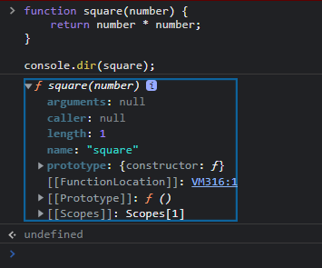

# 함수

💡 **함수란**

어떤 작업을 수행하기 위해 필요한 문(statement)들의 집합을 정의한 코드 블록이다. 함수는 이름과 매개변수를 가지며 필요한 때에 호출하여 코드 블록에 담긴 문들을 일괄적으로 실행할 수 있다.

## 1. 함수 정의

### 1-1 함수 선언문

함수 선언문(Function declaration)방식으로 정의한 함수는 **function** 키워드와 이하의 내용으로 구성.

1. 함수명
    
    함수 선언문의 경우, 함수명은 생략할 수 없다. 함수명은 함수 몸체에서 자신을 재귀적(recursive) 호출하거나 자바스크립트 디버거가 해당 함수를 구분할 수 있는 식별자이다.
    
2. 매개변수 목록
    
    0개 이상의 목록으로 괄호로 감싸고 콤마로 분리한다. 다른 언어와의 차이점은 매개변수의 타입을 기술하지 않는 다는 것.
    
3. 함수 몸체
    
    함수가 호출되었을 때 실행되는 문들의 집합. 중괄호({ })로 문들을 감싸고 **return** 문으로 결과값을 반환할 수 있다.
    

```js
// 함수 선언문
function square(number) {
	return number * number;
}
```

### 1-2 함수 표현식

자바스크립트의 함수는 일급 객체이므로 아래와 같은 특징이 있다.

1. 무명의 리터럴로 표현 가능.
2. 변수나 자료 구조(객체, 배열...)에 저장할 수 있다.
3. 함수의 파라미터로 전달할 수 있다.
4. 반환값(return value)으로 사용할 수 있다.

위의 특성을 이용하여 함수 리터럴 방식으로 함수를 정의하고 변수에 할당할 수 있다.

이러한 방식을 함수 표현식(Function expression)이라 한다.

```js
//함수 표현식
const square = function(number) {
	return number * number;
}
```

함수 표현식 방식으로 정의한 함수는 함수명을 생략할 수 있다. 이러한 함수를 익명 함수**(anonymous function)** 이라 한다. 함수 표현식에서는 함수명을 생략하는 것이 일반적이다.

```js
//기명 함수 표현식
const foo = function multiply(a, b) {
	return a * b;
};

// 익명 함수 표현식(anonymous function expression)
const bar = function(a, b) {
  return a * b;
};

console.log(foo(10, 5)); // 50
console.log(multiply(10, 5)); // Uncaught ReferenceError: multiply is not defined
```

함수는 일급객체이기 때문에 변수에 할당할 수 있는데, 이 변수는 함수명이 아니라 할당된 함수를 가리키는 참조값을 저장한다.

호출시 함수명이 아닌 함수를 가리키는 변수명을 사용하여야 한다.

## 2. 함수 호이스팅

```js
const res = square(5);

function square(number) {
	retunr number * number;
}
```

- 위 코드에서 함수 선언문으로 정의되기 이전에 함수 호출이 가능하다.
- 함수 선언의 위치와는 상관없이 함수 호출이 가능한데 이것을 함수 호이스팅(Function Hoisting)이라 한다.
- **자바스크립트는 ES6의 let, const를 포함하여 모든 선언(var, let, const, function, function*, class)을 호이스팅(Hoisting)한다.
→ let, const도 호이스팅?? >>> 이 부분에 관해서는 TDZ를 보고 다른 페이지에서 기술하자**


💡 **호이스팅이란** 

var 선언문이나 function 선언문이 해당 Scope의 선두로 옮겨진 것처럼 동작하는 특성을 말한다. 즉, 자바스크립트는 모든 선언문(var, let, const, function, function*, class)이 선언되기 이전에 참조 가능하다.
함수 선언문으로 정의된 함수는 자바스크립트 엔진이 스크립트가 로딩되는 시점에 바로 초기화하고 이를 VO(variable object)에 저장한다. 즉, **함수 선언, 초기화, 할당이 한번에 이루어진다.** 그렇기 때문에 함수 선언의 위치와는 상관없이 소스 내 어느 곳에서든지 호출이 가능하다.


**다음은 함수 표현식으로 함수를 정의한 경우이다**

```js
const res = square(5); // TypeError: square is not a function

var square = function(number) {
	return number *number;
}
```

- 이 경우 함수 호이스팅이 아닌 **변수 호이스팅**이 발생한다.


🤔 **변수든 함수든 호이스팅이 일어났다면 square 함수는 작동해야 하지 않을까?**

변수 호이스팅과 함수 호이스팅은 다른 방식으로 발생한다.
변수 호이스팅은  변수 생성 및 초기화, 할당이 분리되어 진행된다. 위 코드에서 square는 변수로 호이스팅 되어 생성과 초기화만 일어났을 것이다. 첫 번째 줄은 undefined로 초기화된 square이고 두 3번째 줄부터 square에 함수가 할당되었기 때문에 오류가 나는 것이다.


> JavaScript: The Good Parts의 저자이며 자바스크립트의 군위자인 더글러스 크락포드(Douglas Crockford)는 이와 같은 문제 때문에 함수 표현식만을 사용할 것을 권고하고 있다. 함수 호이스팅이 함수 호출 전 반드시 함수를 선언하여야 한다는 규칙을 무시하므로 코드의 구조를 엉성하게 만들 수 있다고 지적한다. <br>
또한 함수 선언문으로 함수를 정의하면 사용하기에 쉽지만 대규모 애플리케이션을 개발하는 경우 인터프리터가 너무 많은 코드를 변수 객체(VO)에 저장하므로 애플리케이션의 응답속도는 현저히 떨어질 수 있으므로 주의해야 할 필요가 있다.

## 3. First-class object (일급 객체)


☝ **다음 조건을 만족하면 일급 객체로 간주한다.**

1. 무명의 리터럴로 표현이 가능하다.

```js
const increase = function (num) {
  return ++num;
};

const decrease = function (num) {
  return --num;
};
```

2. 변수나 자료 구조(객체, 배열 등)에 저장할 수 있다.

```js
const predicates = { increase, decrease };
```

3. 반환값으로 사용할 수 있다.

```js
function makeCounter(predicate) {
  const num = 0;

  return function () {
    num = predicate(num);
    return num;
  };
}
```

4. 함수의 매개변수에 전달할 수 있다.

```js
const increaser = makeCounter(predicates.increase);
console.log(increaser()); // 1
console.log(increaser()); // 2
```

## 매개변수(Parameter, 인자)
함수의 작업 실행을 위해 추가적인 정보가 필요할 경우, 매개변수를 지정. 매개변수는 함수 내에서 변수와 동일하게 동작.

### 4-1 매개변수(parameter, 인자) vs 인수(argument)

- 매개변수는 함수 내에서 변수와 동일하게 **메모리 공간을 확보**하며 함수에 전달한 인수는 매개변수에 할당.
- 만약 인수를 전달하지 않으면 매개변수는 undefined로 초기화.

```js
const foo = function (p1, p2) {
  console.log(p1, p2);
};

foo(1);
```

### 4-2 Call-by-value

- 원시타입 인수는 Call-by-value(값에 의한 호출)로 동작. 
- 즉, 함수 호출 시 원시 타입 인수를 함수에 전달할 때 매개변수에 값을 복사하여 함수로 전달.
- 때문에 함수 내에서 매개변수를 통해 값이 변경되어도 전달한 매개변소의 원시 타입 값은 변경되지 않음

  ```js
  function foo(a) {
    a += 1;
    return a
  }

  let x = 0;
  console.log(foo(x)); // 1
  console.log(x) // 0
  ```

  ### 4-3 Call-by-reference

- 객체형(참조형) 인수는 **Call-by-reference**(참조에 의한 호출)로 동작.
- 즉, 함수 호출 시 참조 타입 인수를 함수에 매개변수로 전달할 때 매개변수의 값이 복사되지 않고 참조값이 전달.
- 때문에 함수 내에서 매개변수의 참조값이 이용되어 객체의 값을 변경했을 때, 전달되어진 참조형의 값도 같이 변경.

```js
function changeVal(a, obj) {
  a += 100;
  obj.name = 'Kim';
  obj.gender = 'female';
}

let num = 100;
const obj = {
  name: 'Lee',
  gender: 'male',
}

console.log(num) // 100;
console.log(obj) // Object { name: 'Lee', gender: 'male' }

changeVal(num, obj)

// 함수가 실행된 후 원시값인 num 값은 변하지 않았지만
console.log(num) // 100;
// 객체는 변화했음을 알 수 있다.
console.log(obj) // Object { name: 'Kim', gender: 'female' }
```

## 5. 함수 객체의 프로퍼티
함수는 객체이다. 따라서 함수도 프로퍼티를 가질 수 있다.
```js
function square(number) {
  return number * number;
}
console.log(square);
```

> 단, arguments 프로퍼티는 사용하지 말 것! <br>
> arguments 프로퍼티는 현재 일부 브라우저에서 지원하고 있지만 ES3부터 표준에서 deprecated 되었다. <br>
> Function.arguments와 같은 사용 방법은 권장되지 않으며 함수 내부에서 지역변수처럼 사용할 수 있는 arguments 객체를 참조할 것.

### 5-1 arguments 프로퍼티

arguments 객체는 함수 호출 시 전달된 인수(argument)들의 정보를 담고 있는 순회가능한(iterable) 유사 배열 객체(array-like object)이며 함수 내부에서 지역변수처럼 사용된다. 즉, 함수 외부에서는 사용할 수 없다.

```js
 function multiply(x, y) {
   console.log(arguments); 
   return x * y;
 }

// 함수 호출 시 함수 정의에 따라 인수를 전달하지 않아도 에러가 발생하지 않는다.
 multiply();            // {}
 multiply(1);           // { '0': 1 }
 multiply(1, 2);        // { '0': 1, '1': 2 }
 multiply(1, 2, 3);     // { '0': 1, '1': 2, '2': 3 }
 ```

 - 매개변수의 개수보다 인수를 적게 전달했을 때 (multiply(), multiply(1)) 인수가 전달되지 않은 매개변소는 undefined로 초기화.
 - 매개변수의 개수보다 인수를 더 많이 전달한 경우, 초과된 인수는 무시.

이러한 자바스크립트의 특성 때문에 런타임 시에 호출된 함수의 인자 개수를 확인하고 이에 따른 동작을 정의할 필요가 있을 수 있다. 이때 유용하게 사용되는 것이 arguments 객체이다.

arguments 객체는 매개변수 개수가 확정되지 않은 **가변 인자 함수**를 구현할 때 유용하게 사용된다.
```js
function sum() {
  let res = 0;

  for (let i = 0; i < arguments.length; i++) {
    res += arguments[i];
  }

  return res;
}

console.log(sum());           //0
console.log(sum(1, 2));       //3
console.log(sum(1, 2, 3));    //6
```
- 자바스크립트는 함수를 호출할 때 인수들과 함께 암묵적으로arguments 객체가 함수 내부로 전달.
- 위의 예시처럼 arguments 객체는 배열의 형태로 인자값 정보를 담고 있지만 실제 배열이 아닌 **유사배열객체(array-like object)** 이다.
- 유사배열객체란 length 프로퍼티를 가진 객체를 말하는 것으로 배열이 아니다.

### 6-2 caller 프로퍼티

caller 프로퍼티는 자신을 호출한 함수를 의미한다.
```js
function foo(func) {
  const res = func;
  return res;
}

function bar() {
  return `caller : ${bar.caller}`
}

console.log(foo(bar));  // caller : function foo(func) { ... }
console.log(bar());     // null (browser에서의 실행 결과)
```

### 6-3 length 프로퍼티
length 프로퍼티는 함수 정의 시 작성된 매개변수 개수를 의미

### 6-4 name 프로퍼티
함수명을 나타낸다. 기명함수의 경우 함수명을 값으로 갖고 익명함수의 경우 빈문자열을 값으로 갖는다.

### 6-5 &#95;&#95;proto&#95;&#95; 접근자 프로퍼티
- 모든 객체는 [[Prototype]]이라는 내부 슬롯이 있다. [[Prototype]] 내부 슬롯은 프로토타입 객체를 가리킨다.
- 프로토타입 객체란 프로토타입 기반 객체 지향 프로그래밍의 근간을 이루는 객체로서 객체간의 상속(Inheritance)을 구현하기 위해 사용된다.
- 즉, 프로토타입 객체는 다른 객체에 공유 프로퍼티를 제공하는 객체이다.

&#95;&#95;proto&#95;&#95; 프로퍼티는 [[Prototype]] 내부 슬롯이 가리키는 프로토타입 객체에 접근하기 위해 사용하는 접근자 프로퍼티이다. 내부 슬롯에는 직접 접근할 수 없고 간접적인 접근 방법을 제공하는 경우에 한하여 접근할 수 있다. [[Prototype]] 내부 슬롯에도 직접 접근할 수 없으며 &#95;&#95;proto&#95;&#95; 접근자 프로퍼티를 통해 간접적으로 프로토타입 객체에 접근할 수 있다.
```js
// __proto__ 접근자 프로퍼티를 통해 자신의 프로토타입 객체에 접근 가능
console.log({}.__proto__ === Object.prototype); // true
```

&#95;&#95;proto&#95;&#95; 프로퍼티는 객체가 직접 소유하는 프로퍼티가 아니라 모든 객체의 프로토타입 객체인 Object.prototype 객체의 프로퍼티이다. 모든 객체는 상속을 통해 &#95;&#95;proto&#95;&#95; 접근자 프로퍼티는 사용할 수 있다.

```js
// 객체는 __proto__ 프로퍼티를 소유하지 않는다.
console.log(Object.getOwnPropertyDescriptor({}, '__proto__'));
// undefined

// __proto__ 프로퍼티는 모든 객체의 프로토타입 객체인 Object.prototype의 접근자 프로퍼티이다.
console.log(Object.getOwnPropertyDescriptor(Object.prototype, '__proto__'));
// {get: ƒ, set: ƒ, enumerable: false, configurable: true}

// 모든 객체는 Object.prototype의 접근자 프로퍼티 __proto__를 상속받아 사용할 수 있다.
console.log({}.__proto__ === Object.prototype); // true
```

### 6-6 prototype 프로퍼티
prototype 프로퍼티는 함수 객체만이 소유하는 프로퍼티이다. 즉 일반 객체에는 prototype 프로퍼티가 없다.

```js
// 함수 객체는 prototype 프로퍼티를 소유한다.
console.log(Object.getOwnProtpertyDescriptor(function() {}, 'prototype'));
// { value: {…}, writable: true, enumerable: false, configurable: false }

// 일반 객체는 prototype 프로퍼티를 소유하지 않는다.
console.log(Object.getOwnPropertyDescriptor({}, 'prototype'));
// undefined
```