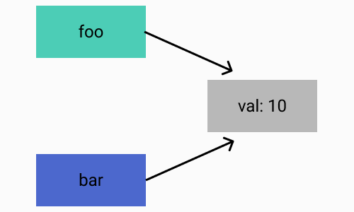

# 객체

작성시간: 2022년 3월 1일 오후 4:35
태그: 메소드, 생성자, 인스턴스, 프로퍼티

# 1. 객체(Object)란?

- 객체란 데이터를 의미하는 **프로퍼티(property)**와 데이터를 참조하고 조작할 수 있는 동작(behavior)을 의미하는 **메소드(method)**로 구성된 집합
- 즉, 객체는 데이터(프로퍼티)와 그 데이터와 관련된 동작(메소드)으로 이루어진 모델(?)
- 자바스크립트의 객체는 객체지향의 상속을 구현하기 위해 **“프로토타입(prototype)”**이라고 불리는 객체의 프로퍼티와 메소드를 상속받을 수 있다. → 이후 정리할 것

### 1-1 프로퍼티(property)

- 프로퍼티는 key(이름)와 value(값)으로 구성된다.
- 프로퍼티는 프로퍼티 key로 유일하게 식별 → 즉, key는 프로퍼티를 식별하기 위한 식별자(identifier)
- 프로퍼티 key : 빈 문자열을 포함하는 모든 문자열 또는 symbol 값
- 프로퍼티 value : 모든 값

### 1-2 메소드(method)

- 프로퍼티 value가 함수일 경우, 일반 함수와 구분하기 위해 메소드라고 부른다.
- 즉, 메소드는 객체에 제한되어 있는 함수를 의미한다.

```jsx
const obj = {
	property1 : 'string',   // -> 프로퍼티
	property2 : function() {  // -> 메소드
		do something ...
	}
}
```

## 2. 객체 생성 방법

- 자바와 같은 클래스 기반 객체 지향 언어는 클래스를 사전에 정의하고 필요한 시점에 new 연산자를 사용하여 **인스턴스**를 생성하는 방식으로 객체를 생성한다.
- 하지만 ES6에서 새롭게 class가 도입되었다. 이 class는 새로운 객체지향 모델을 제공하는 것이 아니다.
- class 도 사실 함수이고 기존 프로토타입 기반 패턴의 문법적 설탕(Syntactic Sugar)이다.
- class는 후에 추가하여 정리하겠다.

### 2-1 객체 리터럴

- 가장 일반적인 자바스크립트 객체 생성방식이다. {} 내에 1개 이상의 프로퍼티를 기술하면 해당 프로퍼티가 추가된 객체를 생성할 수 있다.

```jsx
const emptyObject = {};
console.log(typeof emptyObject); // object

const person = {
  name: "Lee",
  gender: "male",
  sayHello: function () {
    console.log("Hi, My name is " + this.name);
  },
};

console.log(typeof person); // object
console.log(person); // {name: "Lee", gender: "male", sayHello: f}

person.sayHello(); // Hi! My name is Lee
```

### 2-2 Object 생성자 함수

- new 연산자와 Object 생성자 함수를 호출하여 빈 객체를 생성할 수 있다. 이후 프로퍼티 또는 메소드를 추가하여 객체를 완성하는 방법이다.
- **생성자(constructor)** 함수란 new 키워드와 함께 객체를 생성하고 초기화하는 함수를 말한다.
- 생성자 함수를 통해 생성된 객체를 **인스턴스(instance)**라 한다.

```jsx
const person = new Object();

person.name = "Lee";
person.gender = "male";
person.sayHello = function () {
  console.log("Hi! My name is " + this.name);
};

console.log(typeof person); // object
console.log(person); // {name: "Lee", gender: "male", sayHello: ƒ}

person.sayHello(); // Hi! My name is Lee
```

- 하지만 굳이 빈 객체를 Object를 생성자 함수로 할 필요는 없을 것 같.

### 2-3 생성자 함수

- 아래와 같은 경우 여러 개의 객체를 생성할 때 불편할 것이다.

```jsx
const person1 = {
  name: "Lee",
  gender: "male",
  sayHello: function () {
    console.log("Hi! My name is " + this.name);
  },
};

const person2 = {
  name: "Kim",
  gender: "female",
  sayHello: function () {
    console.log("Hi! My name is " + this.name);
  },
};
```

이렇게 일일이 정의하는 것보다 생성자 함수를 사용한다면 아래와 같다.

```jsx
// 생성자 함수
function Person(name, gender) {
  const married = true;
  this.name = name;
  this.gender = gender;
  this.sayHello = function () {
    console.log("Hi! My name is " + this.name);
  };
}

// 인스턴스의 생성
const person1 = new Person("Lee", "male");
const person2 = new Person("Kim", "female");

console.log("person1: ", typeof person1);
console.log("person2: ", typeof person2);
console.log("person1: ", person1);
console.log("person2: ", person2);

person1.sayHello();
person2.sayHello();
```

- 생성자 함수 이름은 일반적으로 대문자로 시작한다.
- 프로퍼티와 메소드명 앞에 기술한 **this**는 생성자 함수가 생성할 **인스턴스(instance)**를 가리킨다.
- **this**에 바인딩되어 있는 프로퍼티와 메소드는 **public(**외부에서 참조 가능)하다.
- 생성자 함수 내에서 선언된 일반 변수는 **private**(외부에서 참조 불가능)하다.

※ new 연산자와 함께 함수를 호출하면 this 바인딩이 다르게 동작한다. → 후에 기술

## 3. 객체 접근

<aside>
💡 객체 접근 방식의 일부만을 정리하였습니다.

</aside>

### 3-1 프로퍼티 삭제

- delete 연산자를 사용하여 객체의 프로퍼티 삭제 가능하다. 피연산자는 프로퍼티 키이어야 한다.

```jsx
const person = {
  first_name: "won",
  last_name: "Lee",
  gender: "male",
};

// 피연산자가 프로퍼티일 경우
delete person.gender;
console.log(person.gender); // undefined

// 피연산자가 프로퍼티가 아닐 경우
delete person;
console.log(person); // {first_name: 'won', last_name: 'Lee',};
```

### 3-2 for-in 문

```jsx
const person = {
  "first-name": "Ung-mo",
  "last-name": "Lee",
  gender: "male",
};

// prop에 객체의 프로퍼티 이름이 반환된다. 단, 순서는 보장되지 않는다.
for (let prop in person) {
  console.log(prop + ": " + person[prop]);
}

// first-name: Ung-mo
// last-name: Lee
// gender: male

const array = ["one", "two"];

// index에 배열의 경우 인덱스가 반환된다
for (let index in array) {
  console.log(index + ": " + array[index]);
}

// 0: one
// 1: two

//--------------------------------------------------------------------------------------
// 배열 요소들만을 순회하는 ES6에서 for-of 문이 추가되었다.
for (const value of array) {
  console.log(value);
}

// one
// two

for (const [index, value] of array.entries()) {
  console.log(index, value);
}

// 0 one
// 1 two
```

## 4. Pass-by-reference (참조에 의한 전달)

- object type을 객체 타입 또는 참조 타입이라 한다.
- 참조 타입이란 객체의 모든 연산이 실제값이 아닌 참조값으로 처리됨을 의미한다.
- 원시 타입은 값이 한번 정해지면 변경할 수 없지만(immutable), 객체는 프로퍼티를 변경, 추가, 삭제가 가능하므로 변경 가능( mutable)한 값이라 할 수 있다.
- 동적으로 변화하는 객체 타입은 메모리의 공간을 어느정도로 확보해야 하는지 예측이 불가능하다. 때문에 런타임에 메모리 공간을 확보하고, 메모리의 힙 영역에 저장한다.

### 먼저 **Pass-by-value**

아래와 같이 a라는 변수에 10이라는 값을 할당한다. 즉 메모리의 새로운 공간에 10이라는 값을 저장한 것이다. 이후 a의 값을 재할당하더라도 b에는 영향을 미치지 않는다.
그 이유는 원시 타입은 값(value)으로 전달되기 때문이다. b가 a의 메모리 주소를 가르키는 것이 아니라 메모리의 새로운 공간에 값(value)만을 복사하여 저장하였기 때문이다.

```jsx
let a = 10;
let b = a;

console.log(a); //10
console.log(b); //10
console.log(a === b); // true

a = 9;
console.log(a); //9
console.log(b); //10
console.log(a === b); // false
```

### 객체의 경우

```jsx
const foo = {
  val: 10,
};

const bar = foo;
console.log(foo.val, bar.val); // 10 10
console.log(foo === bar); // true

bar.val = 20;
console.log(foo.val, bar.val); // 20 20
console.log(foo === bar); // true
```

변수 foo는 객체 자체를 저장하는 것이 아니라 생성된 객체의 참조값(address)을 저장하고 있기 때문이다. 그림으로 나타낸다면 이해가 쉽다.



즉 변수 foo,bar 모두 동일한 객체를 참조하고 있기 때문에 위의 결과처럼 나오게 되는 것이다.

※ 참고: [https://poiemaweb.com/js-object](https://poiemaweb.com/js-object)
