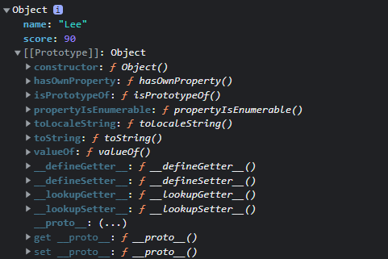

# 프로토타입

## 1. 프로토타입 객체
- 자바스크립트는 Java, C++과 같은 클래스 기반 객체지향 언어와 달리 **프로토타입** 기반 객체지향 프로그래밍 언어이다.
- 자바스크립트는 클래스 없이 객체를 생성할 수 있다.

### 자바스크립트의 객체 생성 방법
- 자바스크립트의 모든 객체는 자신의 부모 역할을 담당하는 객체와 연결되어 있다. 이것은 마치 객체 지향의 상속 개념과 같이 부모 객체의 프로퍼티와 메소드를 상속 받아 사용할 수 있게 한다.
- 이와 같은 부모 객체를 __Prototype(프로토타입) 객체__ 또는 줄여서 Prototype(프로토타입)이라 한다.
  
```js
const student = {
  name: "Lee",
  score: 90,
}
console.dir(student)
```


- ECMAScript spec에서는 자바스크립트의 모든 객체는 [[Prototype]]이라는 인터널 슬롯(internal slot)을 가지며 상속을 구현하는데 사용된다.
- [[Prototype]] 객체의 데이터 프로퍼티는 get 액세스를 위해 상속되어 자식 객체의 프로퍼티처럼 사용 가능하다. 하지만 set은 불가능하다.
- [[Prototype]]의 값은 Prototype(프로토타입)객체이며  &#95;&#95;proto&#95;&#95;로 access property로 접근할 수 있다.
-  &#95;&#95;proto&#95;&#95;에 접근하면 내부적으로 Object.getPrototypeOf가 호출되어 객체를 반환한다.
> 인터널 속성이란 ECMAScript 문서에서 자바스크립트 내부 동작의 설명을 위해 정의해놓은 가상 메소드라고 이해하자.

```js
const student = {
  name: "Lee",
  score: 90,
}
console.log(student.__proto__ === Object.prototype); // true
```

## 2. [[Prototype]] vs prototype 프로퍼티

- 모든 객체는 자신의 프로토타입 객체를 가리키는 [[Prototype]] 인터널 슬롯(internal slot)을 가지며 상속을 위해 사용된다.
- 함수도 객체이므로 [[Prototype]] 인터널 슬롯을 갖는다. 단, 일반 객체와 달리 prototype 프로퍼티도 소유한다.
> 주의: prototype 프로퍼티와 [[Prototype]] 인터널 슬롯은 모두 프로토타입 객체를 가리키지만 다르다. 관점의 차이가 있다.

