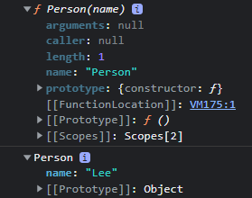

# 프로토타입

## 1. 프로토타입 객체
- 자바스크립트는 Java, C++과 같은 클래스 기반 객체지향 언어와 달리 **프로토타입** 기반 객체지향 프로그래밍 언어이다.
- 자바스크립트는 클래스 없이 객체를 생성할 수 있다.

### 자바스크립트의 객체 생성 방법
- 자바스크립트의 모든 객체는 자신의 부모 역할을 담당하는 객체와 연결되어 있다. 이것은 마치 객체 지향의 상속 개념과 같이 부모 객체의 프로퍼티와 메소드를 상속 받아 사용할 수 있게 한다.
- 이와 같은 부모 객체를 __Prototype(프로토타입) 객체__ 또는 줄여서 Prototype(프로토타입)이라 한다.
  
```js
const student = {
  name: "Lee",
  score: 90,
}
console.dir(student)
```


- ECMAScript spec에서는 자바스크립트의 모든 객체는 [[Prototype]]이라는 인터널 슬롯(internal slot)을 가지며 상속을 구현하는데 사용된다.
- [[Prototype]] 객체의 데이터 프로퍼티는 get 액세스를 위해 상속되어 자식 객체의 프로퍼티처럼 사용 가능하다. 하지만 set은 불가능하다.
- [[Prototype]]의 값은 Prototype(프로토타입)객체이며  &#95;&#95;proto&#95;&#95;로 access property로 접근할 수 있다.
-  &#95;&#95;proto&#95;&#95;에 접근하면 내부적으로 Object.getPrototypeOf가 호출되어 객체를 반환한다.
> 인터널 속성이란 ECMAScript 문서에서 자바스크립트 내부 동작의 설명을 위해 정의해놓은 가상 메소드라고 이해하자.

```js
const student = {
  name: "Lee",
  score: 90,
}
console.log(student.__proto__ === Object.prototype); // true
```

## 2. [[Prototype]] vs prototype 프로퍼티

- 모든 객체는 자신의 프로토타입 객체를 가리키는 [[Prototype]] 인터널 슬롯(internal slot)을 가지며 상속을 위해 사용된다.
- 함수도 객체이므로 [[Prototype]] 인터널 슬롯을 갖는다. 단, 일반 객체와 달리 prototype 프로퍼티도 소유한다.
> 주의: prototype 프로퍼티와 [[Prototype]] 인터널 슬롯은 모두 프로토타입 객체를 가리키지만 다르다. 관점의 차이가 있다.

```js
function Person(name) {
  this.name = name;
}

const foo = new Person('Lee');

console.dir(Person);  // prototype 프로퍼티 존재
console.dir(foo);     // prototype 프로퍼티 존재 X
```

### [[Prototype]]

- 함수를 포함한 모든 객체가 가지고 있는 __인터널 슬롯__.
- 객체의 입장에서 자신의 부모 역할을 하는 프로토타입 객체를 가리킨다.
- 함수 객체의 경우 Function.prototype을 가리킨다.

### prototype 프로퍼티

- ```함수 객체만``` 가지고 있는 프로퍼티.
- 함수 객체가 생성자로 사용될 때 이 함수를 통해 생성될 객체의 부모 역할을 하는 객체(프로토타입 객체)를 가리킨다.

## 3. constructor 프로퍼티

프로토타입 객체는 contructor 프로퍼티를 갖는다. 이 constructor 프로퍼티는 객체의 입장에서 자신을 생성한 객체를 가리킨다.
```js
function Person(name) {
  this.name = name;
}

const foo = new Person('Lee');

// Person() 생성자 함수에 의해 생성된 객체를 생성한 객체는 Person() 생성자 함수이다.
console.log(Person.prototype.constructor === Person);

// foo 객체를 생성한 객체는 Perso() 생성자 함수이다.
console.log(foo.constructor === Person);

// Person() 생성자 함수를 생성한 객체는 Function() 생성자 함수이다.
console.log(Person.constructor === Function);
```

## 4. Prototype chain

특정 객체의 프로퍼티나 메소드에 접근하려고 할 때 해당 객체에 접근하려는 프로퍼티 또는 메소드가 없다면 [[Prototye]]이 가리키는 링크를 따라 자신의 부모 역할을 하는 프로토타입 객체의 프로퍼티나 메소드를 차례대로 검색하는 것.

```js
const student = {
  name: 'Lee',
  score: 90,
}

// Object.prototype.hasOwnProperty()
console.log(student.hasOwnProperty('name')); // true
```
- student 객체는 hasOwnProperty 메소드를 가지고 있지 않다.
- 하지만 에러가 발생하지 않고 정상적으로 결과가 출력되었다.
- 이는 student 객체의 [[Prototype]]이 가리키는 링크를 따라가서 student객체의 부모 역할인 프로토타입 객체(Object.prototype)의 메소드를 호출하였기 때문에 가능한 것.
  
### 4-1 객체 리터럴 방식으로 생성된 객체의 프로토타입 체인

객체 생성 방법은 ```객체 리터럴```, ```생성자 함수```, ```Object() 생성자 함수``` 3가지가 있다. <br>
객체 리터럴 방식으로 생성된 객체는 Object() 생성자 함수로 객체를 생성하는 것을 단순화한 것이다. 내부적으로는 Object() 생성자 함수를 통해 객체가 생성된다. <br>
Object() 생성자 함수는 물론 함수이다. 따라서 함수 객체인 Object() 생성자 함수는 일반 객체와 달리 prototype 프로퍼티가 있다.

```js
const person = {
  name: 'Lee',
  gender: 'male',
  sayHello: function(){
    console.log('Hi! my name is ' + this.name);
  }
};

console.dir(person)

console.log(person.__proto__ === Object.prototype);                 // ① true
console.log(Object.prototype.constructor === Object);               // ② true
console.log(Object.__proto__ === Function.prototype);               // ③ true
console.log(Function.prototype.__proto__ === Function.prototype);   // ④ true
```


### 4-2 생성자 함수로 생성된 객체의 프로토타입 체인

함수를 정의하는 방식은 ```함수 선언식```, ```함수표현식```, ```Function() 생성자 함수``` 3가지가 있다.

1. 함수표현식
함수 리터럴 방식을 사용한다.

```js
const square = function(number) {
  return number * number;
};
```
2. 함수선언식
함수선언식의 경우 자바스크립트 엔진이 내부적으로 기명 함수표현식으로 변환.

```js
const square = function square(number) {
  return number * number;
};
```
위의 예시처럼 결국 모두 함수 리터럴 방식을 사용하고 있음을 알 수 있다. 함수 리터럴 방식은 Function() 생성자 함수로 생성하는 것을 단순화 시킨 것이다. 즉, 함수를 정의하는 3가지 방법 모두 Function() 생성자 함수를 통해 함수 객체를 생성하는 것이다. <br>
따라서 어떠한 방식으로 함수 객체를 생성하여도 모든 함수 객체의 prototype 객체는 Function.prototype이다. 생성자 함수도 함수 객체이므로 생성자 함수의 prototype 객체는 Function.prototype이다.

```js
function Person(name, gender) {
  this.name = name;
  this.gender = gender;
  this.sayHello = function() {
    console.log('Hi! my name is ' + this.name);
  };
};

const foo = new Person('Lee', 'male');

console.dir(Person);
console.dir(foo);

console.log(foo.__proto__ === Person.prototype);                // true
// foo가 물려받은 __proto__는 Person의 prototype이다.
console.log(Person.prototype.__proto__ === Object.prototype)    //true
// Person이 물려줄 prototype의 [[Prototype]]은 Object의 prototype이다.
```

