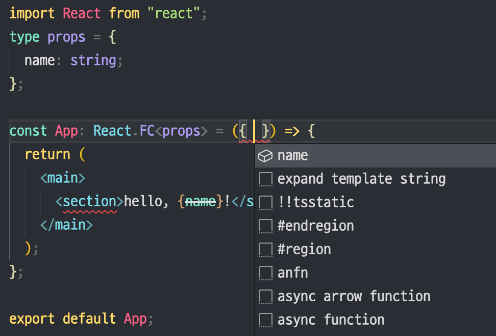
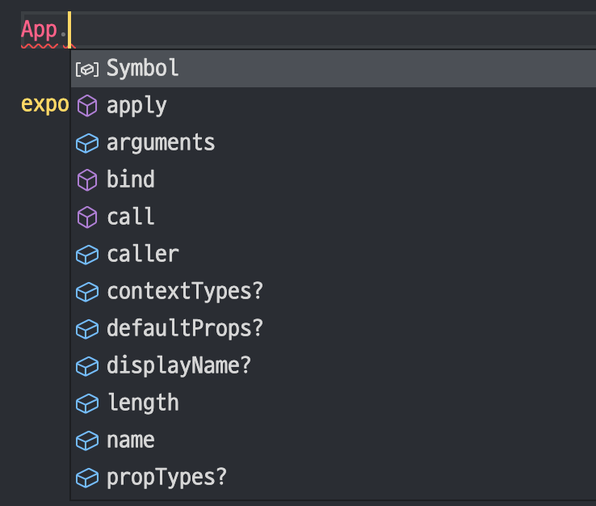
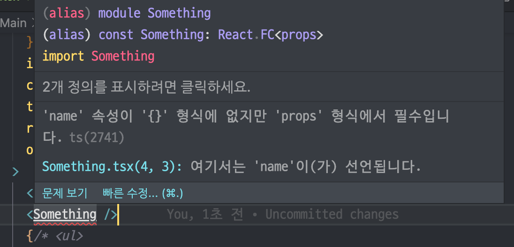
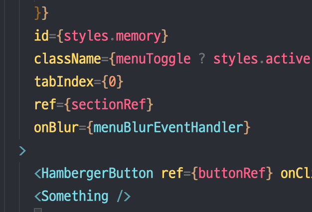

# React에서의 Type

## 1. React.FC
React의 FC type을 사용하는 방법이 있다. 사용할 때는 아래 코드와 같이 props의 타입을 Generics 로 넣어 사용한다.

```tsx
import React from 'react';

type props= {
  name: string;
}

const Something: React.FC<props> = ({ name }) => {
  return (
    <main>
      <section>hello, {name}!</section>
    </main>
  )
}
```
이와 같은 방법을 사용할 때는 velopert님은 장점 두 가지를 언급하고 있다.

**첫 번째로 props 에 기본적으로 `children`이 들어가 있다는 점.**
  
확인을 위해 직접 코드를 통해 테스트 해보았지만 children이 존재하지 않았다.

궁금해서 구글링 한 결과 현재는 FC에 children type이 빠져있어서 직접 type을 직접 정의해주어야 한다고 한다. 때문에 이 점은 장점이 될 수 없다.<br>
[stackoverflow 참고](https://stackoverflow.com/questions/71788254/react-18-typescript-children-fc)

**두 번째는 defaultProps, propTypes 등의 자동완성**


그리고 velopert님은 단점 또한 언급했는데 그 내용은 아래와 같다.

**첫 번째의 FC 타입을 사용하게 되면 children이 옵셔널 형태이기 때문에 props의 타입이 명백하지 않다는 점이다.**

 children을 사용하는 컴포넌트도 있지만 사용해서는 안되는 컴포넌트가 있다면 그에 대한 처리를 따로 해야하기 때문에 children props가 기본적으로 들어가 있는 것은 장점이 아닐 수도 있다. 다만 이제는 FC 타입이 기본적오르 children props가 들어가 있지 않기 때문에 이 또한 단점으로 작용할 경우는 없을 것이다.

**두 번째 단점은 작동하지 않는 defaultProps이다.**

defaultProps는 props를 필요로 하는 컴포넌트에 기본 props값을 정의할 때 사용한다.
```tsx
import React from "react";

type props = {
  name: string;
};

const Something: React.FC<props> = ({ name }) => {
  return (
    <main>
      <section>{name}</section>
    </main>
  );
};

Something.defaultProps = {
  name: "won",
};

export default Something;
```


위 코드에서는 defaultProps를 사용했기 때문에 name props에 따로 값을 내려주지 않아도 컴포넌트는 사용할 수 있어야 하지만 name 값을 요구하고 있다.

## 2. props의 타입 정의
FC의 사용은 children props의 옵셔널 타입이 사라지면서 불편은 줄었지만 defaultProps 문제는 여전히 남아있다. 때문에 FC를 생략하고 props의 타입을 정의하는 방법을 사용한다면 문제를 해결할 수 있다.

```tsx
import React from "react";

type props = {
  name: string;
};

const Something = ({ name }: props) => {
  return (
    <main>
      <section>{name}</section>
    </main>
  );
};

Something.defaultProps = {
  name: "won",
}

export default Something;
```



## 그 외
참고한 글에서는 리액트에서의 Type 지정을 설명하는 글이지만 추가로 많은 정보들을 담고 있다.
- type과 interface은 자유롭게 사용하면 된다. 하지만 사용하게 된다면 하나만 사용해라
- 화살표 함수, function의 사용은 취향, 하지만 이 또한 사용한다면 하나만 동일하게 사용
  
## 참고

[velopert님의 velog](https://velog.io/@velopert/create-typescript-react-component)